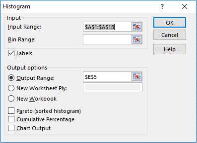
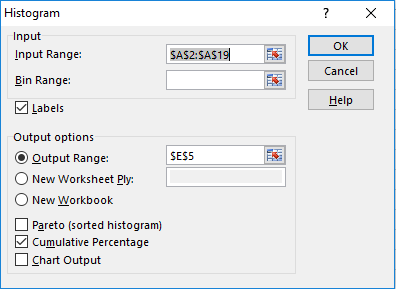
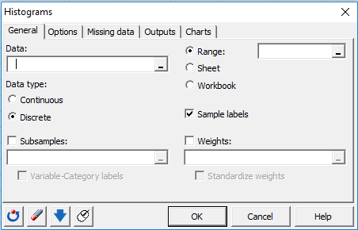

<style>

body {
  background-color: #000029;
}

body p {
  color: blue;
  font-size: 15px;
}

body hgroup h2 {
  color: black;
}
.footer {
    color: White;
    background: Dodgerblue;
    position: fixed;
    top: 88%;
    text-align: center;
    width: 100%;
}

ul {
  display: block;
  font-size: 20px;
  margin-top: 0;
  margin-bottom: 0;
  margin-left: 0;
  margin-right: 0;
  font-weight: bold;
  color: blue;
}
slides > slide.title-slide p {
  color: blue;
  font-size: 15px;
}


slides > slide.title-slide hgroup h1 {
  color: black;
  font-size: 40px;
  letter-spacing: 0;
}


slides > slide.{
  background: none !important;
  background-color: #444444 !important;
}

slides > slide.backdrop {
  background: white;
}

</style>

```{r setup, include=FALSE}
knitr::opts_chunk$set(echo = FALSE)
library(plotly)
library(dplyr)
library(qcc)
```

## Chapter 2 Section 1 Objectives

<H3><font color="black">Frequency and Distributions for Organizing and Summarizing Data</font></H3>
<br>


- Develop an ability to summarize data in the format of a frequency distribution and a relative frequency distribution.
- For a frequency distribution, identify values of class width, class midpoint, class limits, and class boundaries.

## Definitions

- **Fequence distribution (frequency table)** - data partitioned among several categories by listing categories along with the number of data values in each of them.
- **Lower class limit** - Smallest numbers that can belong to each different class.
- **Upper class limit** - Largest numbers that can belong to each different class.
- **Class Boundaries** - Numbers used to separate classes, but without gaps created by gap limits.
- **Class Midpoints** - Values in the middle of the classes.
- **Class width** - Difference between lower class limits.
 
## Constructing a Frequency Table

1) <font color="blue">Select a number of classes. Generally between 5 and 20.</font>
2) <font color="blue">Calculate class width.</font>
<font color="black">$$ \textrm{Class width} \approx \frac{(\textrm{Max data value} - (\textrm{Min data value}))}{\textrm{number of classes}} $$</font>
<font color="blue">**Round up!**</font>
3) <font color="blue">Choose the lower class starting value by using the minimum value or a convenient value below the minimum.</font>
4) <font color="blue">Then use the lower limit and class width to create the other lower classes.</font>

    
## Frequency Table Setup Example

Lets assume we have a set of data with a minimum value of 51 and a maximum value of 223. We have 6 desired classes.

1) <font color="blue">We select 6 classes</font>
2) <font color="blue">$\frac {223 - 51}{6} = 28\frac{2}{3}$ Class width is 29</font>
3) <font color="blue">let 51 be the lower class limit.</font>

## Frequency Table

| Lower class limit | Upper class limit | 
|-------------------|-------------------|
| 51  | 79  | 
| 80  | 108 | 
| 109 | 137 | 
| 138 | 166 |
| 167 | 195 |
| 196 | 224 |
 
## Lets do it in Excel

Open up the chapter 2 excel document from moodle.

On sheet 1 there are some random values from 51 to 223.

Click Data $\rightarrow$ Select Data Analysis $\rightarrow$ Select histogram $\rightarrow$ Click OK




## Relative Frequency Distribution

Open up the chapter 2 excel document from moodle.

On sheet 1 there are some random values from 51 to 223.

Click Data $\rightarrow$ Select Data Analysis $\rightarrow$ Select histogram $\rightarrow$ Click OK



## Normal Distribution

Frequencies start out low and increase in the middle, then tend toward lower frequencies. This distribution is approximately symmetric.

## Chapter 2 Section 2 Objectives

<H3><font color="black">Frequency and Distributions for Organizing and Summarizing Data</font></H3>
<br>


- Develop the ability to picture the distribution of data in the format of a histogram or relative frequency histogram.
- Examine a histogram and identify common distributions, include a uniform distribution and a normal distribution.

## Definitions

- ** Histogram ** - a graph consisting of bars of equal width drawn adjacent to each other. Horizontal scales represents classes of quantitative data values and vertical scales represent frequencies.

```{r}
hist(mtcars$mpg, main = "Histogram of cars MPG", xlab = "Miles per gallon", col = "lightblue")
```

## Types of distributions

```{r}
set.seed(31432)
x <- rnorm(10000)
y <- runif(10000)
z <- rexp(10000)
z2 <- -z
par(mfrow=c(2,2))
hist(x, main = "Normal", col = "lightblue")
hist(y, main = "Uniform", col = "lightblue")
hist(z, main = "Right Skewed", col = "lightblue")
hist(z2, main = "Left Skewed", col = "lightblue")
```


## Create a Histogram in Excel

Install XLSTAT

Click XLSTAT Tab $\rightarrow$ Select Visualizing Data $\rightarrow$ Select Histogram




## Chapter 2 Section 3 Objectives

- Develop the ability to graph data using a dotplot, stem plot, time-series graph, Pareto Chart, pit chart, and frequency chart.
- Determine when a graph is deceptive through the use of a nonzero axis or a pictograph that uses an object of area or volume for one-dimensional data.

## Dotplots


```{r}
set.seed(31)

A <- sample(0:10, 100, replace = TRUE)
stripchart(A, method = "stack", offset = .5, at = .15, pch = 19, 
           main = "Dotplot of Random Values", xlab = "Random Values")
```


## Stemplots

```{r}
stem(mtcars$hp)
```

## Time Series Plot

```{r, message=FALSE}

today <- Sys.Date()
tm <- seq(0, 600, by = 10)
x <- today - tm
y <- rnorm(length(x))
p <- plot_ly(x = ~x, y = ~y, mode = 'lines', text = paste(tm, "days from today"))

p
```

## Pareto Graph

```{r}
counts  <- c(80, 27, 66, 94, 33)
defects <- c("price code", "schedule date", "supplier code", "contact num.", "part num.")

dat <- data.frame(
  count = counts,
  defect = defects,
  stringsAsFactors=FALSE
)

dat <- dat[order(dat$count, decreasing=TRUE), ]
dat$defect <- factor(dat$defect, levels=dat$defect)
dat$cum <- cumsum(dat$count)
dat

ggplot(dat, aes(x=defect)) +
  geom_bar(aes(y=count), fill="blue", stat="identity") +
  geom_point(aes(y=cum)) +
  geom_path(aes(y=cum, group=1))
```

## Pie Chart

```{r}
slices <- c(10, 12, 4, 16, 8) 
lbls <- c("US", "UK", "Australia", "Germany", "France")
pct <- round(slices/sum(slices)*100)
lbls <- paste(lbls, pct) # add percents to labels 
lbls <- paste(lbls,"%",sep="") # ad % to labels 
pie(slices,labels = lbls, col=rainbow(length(lbls)),
  	main="Pie Chart of Countries")
```

## Chapter 3 Section 1 Objectives

- Develop the ability to measure the center of data by finding the mean, median, mode and midrange
- Determine whether an outlier has a substantial effect on the mean and median

# Definititions

- **Measure of Center** - Value at the center or middle of the data set.
- **Mean** - Measure of center found by adding all the data values together and dividing by the total number of data values.
- **Resistant** - The presences of extreme values does not cause it to change much.
- **Median** - Measure of center that is the middle value when the original data values are arranged in order of magnitude.
- **Mode** - The value in the data set that has the greatest frequency.
- **Midrange** - Measure of center that is the value midway between the maximum and minimum values in the data set.

## Properties of the Mean

- Sample means drawn from the same population tend to vary less than other measures of center
- mean of a data set uses every data value
- means are **not** resistant to outliers.

$$ \textrm{Mean} = \frac{1}{n}\Sigma{x}$$
$n$ is the number of values in the data set.

$x$ is used to represent each individual value in a data set.

$\Sigma$ denotes the sum of all data values.

## Properties of Median

- Median does not change by large amounts when there are a few extreme values. The median is resistant.
- Median does not directly use every data value.

**Odd Number of data values** - The median is the middle value.
**Even Number of data values** - The median is the mean of the 2 middle values.


## Properties of Mode

- The mode can be found with qualitative data
- A data set can have no mode, one mode, or multiple mode

## Properties of Midrange

- Because midrange only uses the minimum and maximum data values it is very sensitive to extreme values. The midrange is not resistant
- midrange is rarely used.


